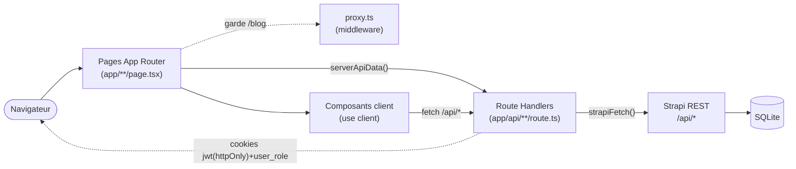
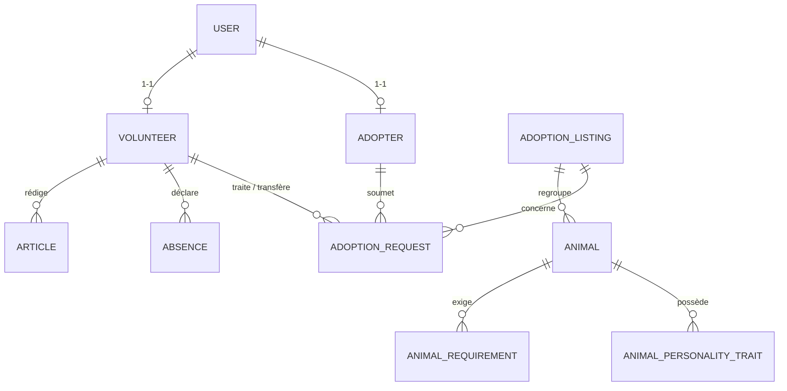
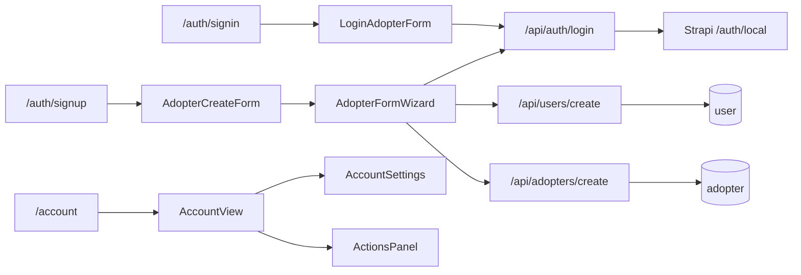
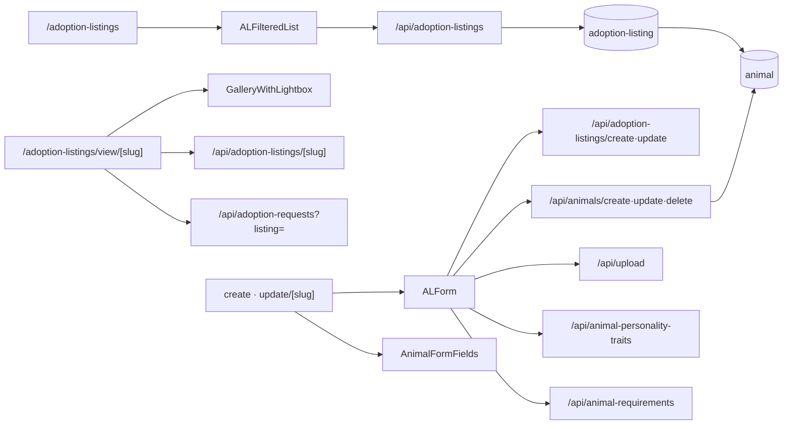
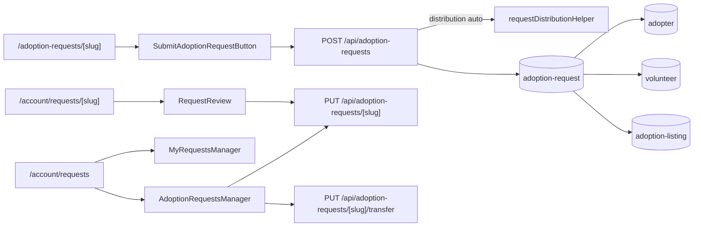
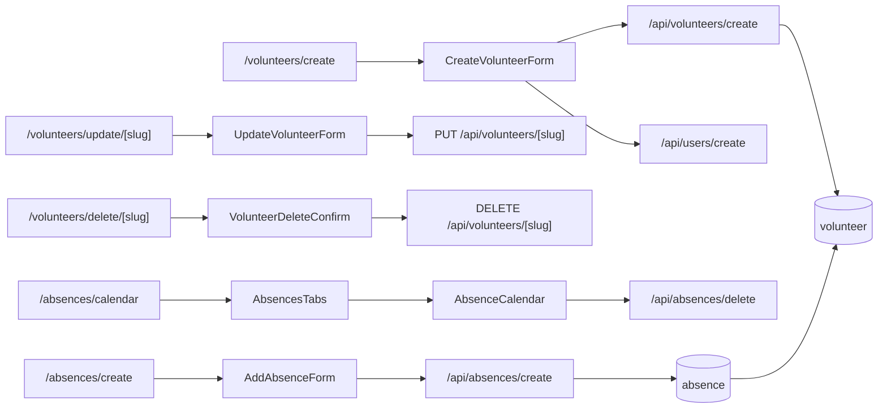
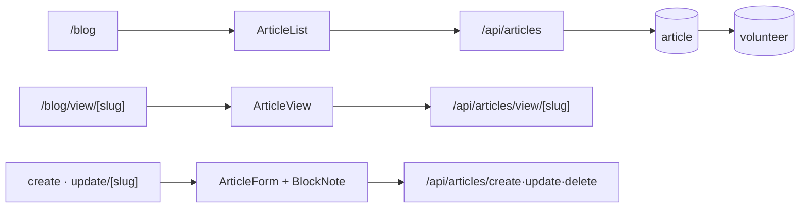
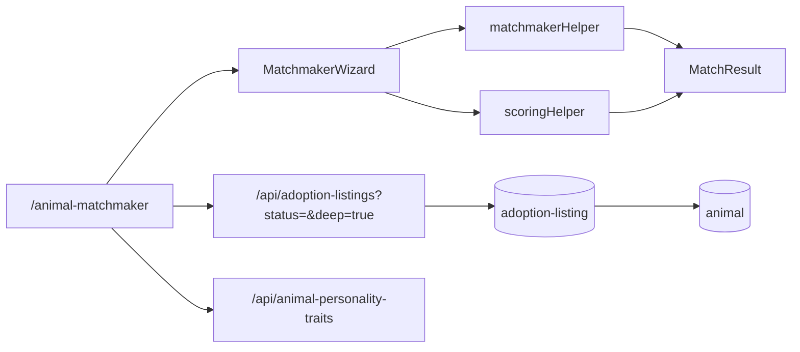

# P'tit Cats — Documentation d'architecture

Association de recueil de chats errants en vue d'adoption. Le projet est composé de **deux applications** :

| Projet | Rôle | Stack |
|---|---|---|
| `ptit-cats-app` | Front-office + back-office (BFF) | Next.js 16 (App Router, React 19), TypeScript, Tailwind, BlockNote |
| `ptit-cats-api` | API de données | Strapi v5 (Community), SQLite par défaut |

---

## 1. Vue d'ensemble & conventions

**Flux général** : le navigateur attaque les pages Next. Toute donnée transite par une **route interne `/app/api/*`** (BFF) — jamais un appel direct à Strapi depuis une page ou un composant. Les route handlers portent seuls le token serveur Strapi et renvoient une réponse normalisée `{ success, data }`. Strapi persiste dans SQLite.

**Conventions clés** (issues d'un refactor de mise en ordre) :

- **Accès aux données unifié** : `page.tsx` / composant → route `/app/api/*` → Strapi. Aucun `fetch` Strapi hors des route handlers (seule exception tolérée : construire une **URL d'image** `${STRAPI}${media.url}`).
- **Plus aucun `action.ts`** (server actions supprimés). Les lectures serveur passent par `serverApiData()`, les mutations client par `fetch("/api/…")` + `router.push`/`router.refresh`.
- **Point d'appel Strapi unique** : `helpers/strapiHelper.ts` → `strapiFetch(path, init)`.
- **Zéro commentaire** dans le code applicatif (commentaires conservés uniquement dans les fichiers de config).
- **Convention helpers** : tout fichier de `helpers/` porte le suffixe `Helper`.
- **Middleware Next 16** = `proxy.ts` (⚠️ créer un `middleware.ts` casserait tout). Il garde la section `/blog`.
- **Toute la logique métier vit dans le front** : le back Strapi est du **factory par défaut** (aucun controller/route/service custom).

---

## 2. Schéma des chemins & relations

### 2.1 Architecture en couches



### 2.2 Modèle relationnel (entités Strapi)



### 2.3 Domaines — routes → composants → entités

**Auth & compte**


**Annonces & animaux**


**Demandes d'adoption** (croisement adoptant / annonce / bénévole)


**Bénévoles & absences**


**Blog** (section gardée par `proxy.ts`)


**Pet/animal matchmaker**


---

## 3. Modèle de données (entités Strapi)

> `entityStatus` sert de statut métier propre à chaque entité. `users_permissions_user` lie une entité métier au compte de connexion (plugin users-permissions).

### user *(plugin users-permissions, draft&publish off)*
`username`, `email`, `password`, `provider`, `confirmed`, `blocked`, `role → users-permissions.role`. Compte de connexion. Rôles u&p configurés : **8 = Adopter**, **6 = Admin**, **7 = Manager/Referent**.

### adopter *(draft&publish on)*
Identité (`lastName`, `firstName`, `birthDate`, `email`, `phoneNumber`, `password`, `address`, `postalCode`, `city`), **foyer** (`householdType` [single|couple|family|shared accommodation|other], `householdComposition`, `hasChildren`, `childrenAgeGroup` [young|old|both], `householdPresence` [always|often|sometimes|rarely], `householdAgreement`, `disagreementDetails`), **travail** (`employmentStatus`, `employmentArrangement`), **logement** (`housingType` [apartment|house|other], `housingSurface`, `apartmentFloor`, `areWindowsSecuredOrWillBe`, `hasBalconyOrTerrace`, `isBalconySecured`, `hasGarden`, `gardenSurface`, `fenceHeight`, `livingEnvironment` [urban|suburban|rural], `isNearBusyRoad`, `animalCanGoOutside`), **autres animaux** (`hasOtherAnimals`, `otherAnimalsDetails`, `areOtherAnimalsSterilizedOrCastrated`, `firstAnimalOwnershipDate`), `remarks`, `hasAcceptedResponsibility`.
Relations : `adoption_requests` (1..n), `users_permissions_user` (1-1).

### volunteer *(draft&publish on)*
`lastName`, `firstName`, `email`, `password`, `role` [**admin | manager | referent**]. Relations : `absences` (1..n), `articles` (1..n), `adoption_requests` (1..n), `users_permissions_user` (1-1).

### adoption-listing *(draft&publish on)*
`title`, `slogan`, `shortDescription`, `longDescription`, `media`, `isDuo`, `price`, `entityStatus` [**adoption pending | adoption completed**]. Relations : `animals` (1..n), `adoption_requests` (1..n).

### animal *(draft&publish on)*
`name`, `sex` [male|female], `birthDate`, soins (`isDewormed`, `isVaccinated`, `isSterilizedOrCastrated`, `isIdentified`), affinités (`dogAffinity`, `catAffinity`, `childAffinity` [yes|no|unknown]), `housingType`, `isAtypical`, `entityStatus` [**in shelter | in foster care | under medical care**]. Relations : `animal_personality_traits` (1..n), `animal_requirements` (1..n), `adoption_listing` (n-1).

### adoption-request *(draft&publish **off**)*
`entityStatus` [**to be processed | pending | refused | done**], `remarks`, `transferredBy` (documentId du responsable ayant transféré). Relations : `adopter` (n-1), `volunteer` (n-1), `adoption_listing` (n-1).

### absence *(draft&publish on)*
`startDate`, `endDate`. Relation : `volunteer` (n-1). Sert au calcul de **disponibilité** dans la distribution des demandes.

### article *(draft&publish on)*
`publicationDate`, `category` (10 valeurs : news, community, inspiringStories, goodToKnow, events, quizzes, everydayLife, PeopleAndStories, health, shopping), `content` (json BlockNote). Relation : `volunteer` (auteur, n-1).

### animal-personality-trait / animal-requirement *(draft&publish on)*
`label` (référentiels rattachés aux animaux).

---

## 4. Front — `ptit-cats-app`

### 4.1 Fichiers racine & configuration

| Fichier | Rôle |
|---|---|
| `app/layout.tsx` | Layout racine : `metadata`, `<Navbar>` + `<Footer>` + `<Button>`, styles globaux. |
| `proxy.ts` | **Middleware Next 16**. Garde `/blog` : redirige si cookies `volunteer_id` + `user_role` absents. `matcher` ciblé sur `/blog`. |
| `next.config.ts`, `eslint.config.mjs`, `postcss.config.mjs`, `tsconfig.json`, `next-env.d.ts` | Config (Next, ESLint, PostCSS/Tailwind, TS). Seuls fichiers autorisés à contenir des commentaires. |
| `.env.local` | `NEXT_PUBLIC_BASE_URL` (URL du front), `NEXT_PUBLIC_STRAPI_BASE_URL` (URL Strapi), `STRAPI_API_TOKEN` (secret serveur). |

### 4.2 Pages (`app/**/page.tsx`)

Colonne « Données » = endpoints `/api/*` consommés (les lectures serveur via `serverApiData`, les mutations via les composants clients listés).

| Route | Composants | Données |
|---|---|---|
| `/` (accueil) | Statistics, ALCarousel, ArticleCard, Card, Button, Heading | `/api/adoption-listings/last`, `/api/articles` |
| `/about`, `/contact`, `/donation`, `/distribution`, `/legal-notice` | Breadcrumb, ui/* | — (contenu statique) |
| `/auth/signin` | Navbar, LoginAdopterForm | via LoginAdopterForm |
| `/auth/signup` | Navbar, AdopterCreateForm | via AdopterFormWizard |
| `/account` | AccountView (→ ActionsPanel / AccountSettings) | `/api/adopters/[id]`, `/api/volunteers/[id]`, `/api/adoption-requests?adopter=` |
| `/account/adopters` | AdoptersManager, AccountSubLayout | `/api/adopters` |
| `/account/volunteers` | VolunteersManager | `/api/volunteers` |
| `/account/listings` | AdoptionListingsManager | `/api/adoption-listings` |
| `/account/articles` | ArticlesManager | `/api/articles?volunteer=` |
| `/account/requests` | MyRequestsManager (adoptant) / AdoptionRequestsManager (bénévole) | `/api/adoption-requests?adopter=` ou `?forVolunteer=` |
| `/account/requests/[slug]` | RequestReview | `/api/adoption-requests/[slug]`, `/api/adopters/[id]` |
| `/adoption-listings` | ALFilteredList | `/api/adoption-listings` |
| `/adoption-listings/view/[slug]` | GalleryWithLightbox | `/api/adoption-listings/[slug]`, `/api/adoption-requests?listing=` |
| `/adoption-listings/create` · `/update/[slug]` | ALForm, AnimalFormFields | `/api/adoption-listings/create·update`, `/api/animals/*`, `/api/animal-personality-traits`, `/api/animal-requirements`, `/api/upload` |
| `/adoption-listings/delete/[slug]` | Button, Heading | `/api/adoption-listings/[slug]` + `/delete`, `/api/animals/delete` |
| `/adoption-requests/[slug]` | Navbar, SubmitAdoptionRequestButton | `/api/adoption-listings/[slug]`, `/api/adopters/[id]`, `/api/adoption-requests?adopter=` |
| `/adopters/view/[slug]` · `/update/[slug]` · `/delete/[slug]` | AdopterEditForm / AdopterDeleteConfirm | `/api/adopters/[slug]` |
| `/volunteers/create` | CreateVolunteerForm | via le composant |
| `/volunteers/view` · `/update/[slug]` · `/delete/[slug]` · `/update` (liste) | UpdateVolunteerForm / VolunteerDeleteConfirm | `/api/volunteers/[slug]`, `/api/volunteers` |
| `/absences` (liste) · `/absences/create` · `/absences/update/[slug]` · `/absences/calendar` | AbsencesTabs, AddAbsenceForm, UpdateAbsenceForm | `/api/absences`, `/api/absences/[slug]`, `/api/volunteers` |
| `/blog` · `/view/[slug]` · `/create` · `/update/[slug]` · `/delete/[slug]` | ArticleList, ArticleView, ArticleForm | `/api/articles(/view·create·update·delete)` |
| `/animal-matchmaker` | MatchmakerWizard | `/api/adoption-listings?status=&deep=true`, `/api/animal-personality-traits`, `/api/adopters/[id]` |

### 4.3 Route handlers (`app/api/**/route.ts`) — le BFF

Tous utilisent `strapiFetch` (helper) et renvoient `{ success, data }`. Ils sont le **seul** endroit qui parle à Strapi.

| Endpoint | Méthodes | Cible Strapi / logique |
|---|---|---|
| `/api/auth/login` | POST | `POST /auth/local` puis résout l'entité liée (adopter→volunteer) ; pose cookies `jwt`(httpOnly), `user_role`, `adopter_id`/`volunteer_id`. |
| `/api/users/create` | POST | Crée le `user` u&p (username auto-généré + suffixe), lie l'entité métier ; mappe le rôle métier → rôle u&p. |
| `/api/adopters` · `/api/adopters/[slug]` · `/api/adopters/[slug]/password` · `/api/adopters/create` | GET / GET·PUT·DELETE / PUT / POST | CRUD adopter. Le PUT reçoit un **FormData** (via `buildAdopterPayload`) et exclut l'email s'il n'a pas changé ; le DELETE supprime aussi le `user` lié ; le password met à jour le `user` lié. |
| `/api/volunteers` · `/api/volunteers/[slug]` · `/api/volunteers/[slug]/password` · `/api/volunteers/create` | GET / GET·PUT·DELETE / PUT / POST | CRUD volunteer. DELETE `?self=true` purge aussi les cookies. |
| `/api/adoption-listings` · `/[slug]` · `/create` · `/update` · `/delete` · `/last` | GET(+`?status`,`?deep`) / GET / POST / PUT / DELETE / GET | CRUD annonces. `?deep=true` populate profond (animaux+traits) pour le matchmaker. |
| `/api/animals/create·update·delete` | POST/PUT/DELETE | CRUD animaux (rattachés à une annonce). |
| `/api/animal-personality-traits` · `/api/animal-requirements` | GET | Référentiels (tri + pageSize). |
| `/api/adoption-requests` · `/[slug]` · `/[slug]/transfer` | GET(`?adopter`/`?volunteer`/`?forVolunteer`/`?listing`)·POST / GET·PUT / PUT | Cœur métier : POST = création + **distribution auto** ; PUT `[slug]` = changement de statut (à `done`, l'annonce liée passe « adoption completed ») ; `/transfer` = réassignation à un référent disponible. |
| `/api/articles` · `/create` · `/view/[slug]` · `/update/[slug]` · `/delete/[slug]` | GET(`?volunteer`) / POST / GET / PUT / DELETE | CRUD articles ; `parseContent` normalise le JSON BlockNote ; l'auteur = cookie `volunteer_id`. |
| `/api/absences` · `/[slug]` · `/create` · `/update` · `/delete` | GET / GET / POST / PUT / DELETE | CRUD absences (pageSize élevé pour le calendrier). |
| `/api/upload` | POST | Proxy multipart vers `POST /upload` (médias). |
| `/api/auth/signout` (route.ts) | POST | Supprime les cookies de session. |

### 4.4 Composants (`components/`)

**Chrome & transverses**
| Fichier | Rôle | Utilise |
|---|---|---|
| `Navbar.tsx` | Barre de navigation (lit l'état de session côté client) | ui/Button |
| `Footer.tsx` | Pied de page | — |
| `Breadcrumb.tsx` | Fil d'Ariane ; mappe chaque segment d'URL → libellé FR (clé `animal-matchmaker`) | — |
| `Statistics.tsx` | Chiffres clés de l'accueil | — |

**`account/`** (espace connecté)
| Fichier | Rôle | Utilise / appelle |
|---|---|---|
| `AccountView.tsx` | Sidebar profil + onglets (`actions`/`compte`) + déconnexion. Label onglet adoptant = `actionsLabel`. | types, roles, ActionsPanel, AccountSettings |
| `ActionsPanel.tsx` | Adoptant → MyRequestsManager ; bénévole → liens d'action selon le rôle | MyRequestsManager, types |
| `AccountSettings.tsx` | Onglet « compte » : édition profil + mot de passe (adoptant → AdopterEditForm + `/api/adopters/[id]/password` ; bénévole → UpdateVolunteerForm + VolunteerPasswordChangeForm) | AdopterEditForm, UpdateVolunteerForm, PasswordChangeForm |
| `AccountSubLayout.tsx` | Gabarit des sous-pages `/account/*` (titre + bouton retour) | Breadcrumb, Button |
| `PasswordChangeForm.tsx` | Formulaire de mot de passe générique (prop `action`) | ui/Input, ui/Button |
| `MyRequestsManager.tsx` | Tableau des demandes de l'adoptant + état vide « 🐱 » | adoptionRequestStatus |
| `AdoptionRequestsManager.tsx` | Tableau des demandes du bénévole ; actions **transférer** / **terminer** | `PUT /api/adoption-requests/[slug](/transfer)` |
| `RequestReview.tsx` | Revue d'une demande (valider/refuser/terminer + remarques) ; vue lecture seule pour l'adoptant | `PUT /api/adoption-requests/[slug]` |
| `AdoptersManager.tsx` · `VolunteersManager.tsx` · `AdoptionListingsManager.tsx` · `ArticlesManager.tsx` · `AbsencesManager.tsx` | Tableaux de gestion (admin/bénévole) avec pagination ; liens vers view/update/delete. `AbsencesManager` supprime via `/api/absences/delete` | ui/Pagination + interfaces |
| `adoptionRequestStatus.ts` | Mappe `entityStatus` → badge (libellé + classe) côté adoptant et bénévole | interfaces |
| `roles.ts` | `ROLE_LABELS`, `ROLE_BADGES` (adoptant + bénévoles) | — |
| `types.ts` | Types `AccountUser` / `AccountAdopter` / `AccountVolunteer` | interfaces |

**`adopter/`**
| Fichier | Rôle | Utilise / appelle |
|---|---|---|
| `AdopterFormWizard.tsx` | **Moteur** de formulaire adoptant multi-étapes (prop `mode`). Création → `/api/adopters/create` + `/api/users/create` + `/api/auth/login` (auto-login) ; édition → `PUT /api/adopters/[slug]` (FormData) | adopterPayloadHelper, ui/* |
| `AdopterCreateForm.tsx` | Wrapper `mode="create"` (page signup) | AdopterFormWizard |
| `AdopterEditForm.tsx` | Wrapper `mode="edit"` + `mapAdopterToFormValues` (compte / admin) | AdopterFormWizard, adopterPayloadHelper |
| `LoginAdopterForm.tsx` | Connexion | `/api/auth/login` |
| `AdopterDeleteConfirm.tsx` | Confirmation de suppression adoptant | `DELETE /api/adopters/[id]` |
| `SubmitAdoptionRequestButton.tsx` | Soumission d'une demande (+ redirection) | `POST /api/adoption-requests` |

**`volunteer/`**
| Fichier | Rôle | Appelle |
|---|---|---|
| `CreateVolunteerForm.tsx` | Création bénévole | `/api/volunteers/create` + `/api/users/create` |
| `UpdateVolunteerForm.tsx` | Édition bénévole (bouton « Mettre à jour » en `w-fit`) | `PUT /api/volunteers/[id]` |
| `VolunteerDeleteConfirm.tsx` | Confirmation de suppression | `DELETE /api/volunteers/[id]` |
| `VolunteerPasswordChangeForm.tsx` | Enrobe PasswordChangeForm | `PUT /api/volunteers/[id]/password` |

**`absence/`**
| Fichier | Rôle | Appelle |
|---|---|---|
| `AbsencesTabs.tsx` | Onglets calendrier / liste | AbsenceCalendar, AbsencesManager |
| `AbsenceCalendar.tsx` | Calendrier mensuel présents/absents | `DELETE /api/absences/delete` |
| `AddAbsenceForm.tsx` | Ajout d'une absence (conversion date→ISO) | `POST /api/absences/create` |
| `UpdateAbsenceForm.tsx` | Modification d'une absence | `PUT /api/absences/update` |

**`adoptionListing/`**
| Fichier | Rôle | Utilise |
|---|---|---|
| `ALCard.tsx` | Carte d'annonce (image, tags, prix) | attributeHelper, tagHelper, followUpHelper |
| `ALCarousel.tsx` | Carrousel d'annonces (accueil) | ALCard |
| `ALFilteredList.tsx` | Liste filtrable + paginée | ALCard, ui/Pagination |
| `ALForm.tsx` | Formulaire d'annonce (create/update) | AnimalFormFields, ui/* |
| `AnimalFormFields.tsx` | Sous-champs d'un animal dans le formulaire d'annonce | ui/Input, ui/Select |
| `GalleryWithLightbox.tsx` | Galerie média avec lightbox (fiche annonce) | — |

**`article/` & `blocknote/`**
| Fichier | Rôle | Utilise |
|---|---|---|
| `ArticleCard.tsx` | Carte d'article (accueil / liste) | — |
| `ArticleList.tsx` | Liste paginée des articles | ArticleCard, articleHelper |
| `ArticleView.tsx` | Rendu d'un article (contenu BlockNote) | DynamicEditor, articleHelper |
| `ArticleForm.tsx` | Formulaire de rédaction (éditeur riche) | DynamicEditor, articleHelper |
| `blocknote/DynamicEditor.tsx` | Import dynamique (SSR off) de l'éditeur | Editor |
| `blocknote/Editor.tsx` | Éditeur BlockNote (upload d'images inclus) | — |

**`matching/`**
| Fichier | Rôle | Utilise |
|---|---|---|
| `MatchmakerWizard.tsx` | Formulaire de préférences multi-étapes + intro (masquée aux résultats) ; calcule via scoringHelper | matchmakerHelper, scoringHelper, MatchResult, ui/* |
| `MatchResult.tsx` | Affichage des meilleurs matchs (« Voici votre compagnon idéal ! » en H2) | ALCard, scoringHelper |

**`ui/`** *(primitives présentational, sans appel réseau)* : `Button`, `Card`, `Heading`, `Input`, `Select`, `Textarea`, `Pagination`. Utilisées partout comme briques de base.

### 4.5 Helpers (`helpers/`)

| Fichier | Exporte / rôle |
|---|---|
| `strapiHelper.ts` | `strapiFetch(path, init)` — base URL + Bearer token. Utilisé **uniquement** par les route handlers. |
| `apiHelper.ts` | `serverApiData<T>(path, fallback)` — fetch serveur vers `${NEXT_PUBLIC_BASE_URL}/api/…`, renvoie `json.data`. Utilisé par les pages serveur. |
| `requestDistributionHelper.ts` | `getVolunteersWithLoad(role)` (charge = demandes actives + présence via absences) et `pickAssignee(pool)` (présent le moins chargé). Utilisé par les routes adoption-requests. |
| `adopterPayloadHelper.ts` | Modèle du formulaire adoptant : `AdopterFormValues`, options d'enums, `mapAdopterToFormValues`, `buildAdopterFormData`, `buildAdopterPayload`. |
| `articleHelper.ts` | `parseContent`, `formatAuthor`, `CATEGORY_OPTIONS`/`CATEGORY_LABELS`, `extractTitle`/`extractDescription`/`extractImageUrl`. |
| `matchmakerHelper.ts` | `MatchFormValues`, options, `deriveHouseholdFromAdopter`, `householdSummary`, constantes de scoring. |
| `scoringHelper.ts` | `scoreListings(values, listings)` → `ScoredMatch[]` (algorithme de compatibilité). |
| `dateHelper.ts` | `calculateAge(date)`. |
| `attributeHelper.ts` · `tagHelper.ts` · `followUpHelper.ts` | Dérivent les attributs / tags / badges d'affichage d'un animal (âge, soins, affinités) pour `ALCard`. |

### 4.6 Interfaces (`interfaces/`)

Types TypeScript alignés sur les content-types Strapi, un par entité : `IAbsence`, `IAdopter`, `IAdoptionListing`, `IAdoptionRequest`, `IAnimal`, `IAnimalPersonalityTrait`, `IAnimalRequirement`, `IArticle`, `IVolunteer`. Consommés par pages, composants et helpers. *(Note : `IVolunteer` inclut `id: number`, requis car renvoyé par Strapi v5.)*

---

## 5. Back — `ptit-cats-api` (Strapi v5)

> ⚠️ **Aucun code métier custom** : tous les `controllers`, `routes`, `services` sont des factories Strapi par défaut. Le comportement de l'API = CRUD REST standard par content-type, filtré par les **rôles users-permissions**. La logique métier (distribution, transferts, statuts…) est entièrement portée par le front (`app/api/*` + helpers).

### 5.1 Content-types (`src/api/*/content-types/*/schema.json`)
Définissent le modèle de données décrit en **§3**. Un dossier par entité : `absence`, `adopter`, `adoption-listing`, `adoption-request`, `animal`, `animal-personality-trait`, `animal-requirement`, `article`, `volunteer`.

### 5.2 Controllers / routes / services
Pour chaque entité, motif identique :
```js
createCoreController('api::<entity>.<entity>')   // controller
createCoreRouter('api::<entity>.<entity>')       // routes REST CRUD
createCoreService('api::<entity>.<entity>')      // service
```
→ endpoints REST standards `GET/POST/PUT/DELETE /api/<pluriel>`, sans surcharge.

### 5.3 Extensions & config
| Fichier | Rôle |
|---|---|
| `src/extensions/users-permissions/content-types/user/schema.json` | Extension du modèle `user` (plugin auth). |
| `src/extensions/documentation/*` | Plugin de documentation Swagger (activé). |
| `src/index.js` | `register` / `bootstrap` **vides**. |
| `config/database.js` | Multi-driver (sqlite par défaut, mysql, postgres). |
| `config/server.js` | Host/port (1337), `APP_KEYS`, webhooks. |
| `config/middlewares.js` | Pile standard Strapi (logger, errors, security, cors, body, session, public…). |
| `config/plugins.js` | Active le plugin `documentation`. |
| `config/admin.js`, `config/api.js` | Config admin & API (defaults). |

---

## 6. Parcours transverses (bout en bout)

1. **Inscription adoptant** — `/auth/signup` → `AdopterFormWizard` → `POST /api/adopters/create` → `POST /api/users/create` (crée + lie le compte u&p) → `POST /api/auth/login` (auto-login, pose les cookies) → hard-navigation vers `/account`.
2. **Connexion** — `LoginAdopterForm` / (bénévole) → `POST /api/auth/login` → `/auth/local` + résolution de l'entité liée → cookies `jwt`(httpOnly) + `user_role` + `adopter_id`/`volunteer_id`.
3. **Soumettre une demande** — fiche annonce → `/adoption-requests/[slug]` (vérifie la complétude du profil) → `SubmitAdoptionRequestButton` → `POST /api/adoption-requests` → **distribution auto** (`requestDistributionHelper` : responsable présent le moins chargé).
4. **Traiter/transférer une demande** — `/account/requests` (bénévole) → `AdoptionRequestsManager` / `RequestReview` → `PUT /api/adoption-requests/[slug]` (statut ; à `done` l'annonce passe « adoption completed ») ou `/transfer` (réassignation à un référent disponible).
5. **Publier une annonce** — `/adoption-listings/create` → `ALForm` (+ `AnimalFormFields`) → `/api/upload` (médias) + `/api/adoption-listings/create` + `/api/animals/create`.
6. **Blog** — section gardée par `proxy.ts` ; rédaction via `ArticleForm` (BlockNote) → `/api/articles/create` (auteur = cookie `volunteer_id`).
7. **Matchmaker** — `/animal-matchmaker` → `MatchmakerWizard` charge les annonces « adoption pending » (populate profond) + les traits, score localement (`scoringHelper`), affiche `MatchResult`.

---

*Documentation générée à partir des schémas Strapi et de l'analyse statique des imports/endpoints de `ptit-cats-app`. Convention d'accès aux données : voir §1.*
